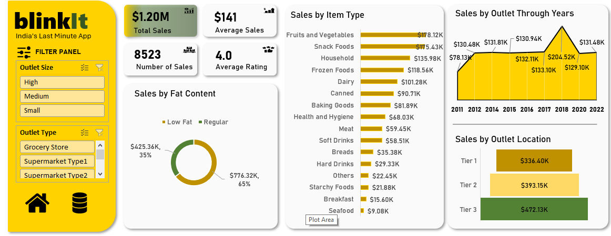

# Sales Dashboard in Excel

This project is an interactive Excel dashboard analyzing sales performance over time, products, and locations.

## 📊 Features
- Dynamic charts (Donut, Area, Bar, Funnel)
- Slicers for Outlet size and Outlet Type
- Formatting for KPIs

## 🔧 Tools Used
- Microsoft Excel
- Pivot Tables
- Slicers
- Charts

##  Business requirements

#### KPIs Requirement
- Total Sales
- Average Sales
- Number of Items sold
- Average Rating

#### Chart Requirements
- Total Sales by fat content (Donut Chart)
- Total Sales by Item Type (Bar chart)
- Total Sales by Outlet Establisment  (Area chart).
- Sales by outlet location (Funnel chart)

## 📷 Preview

